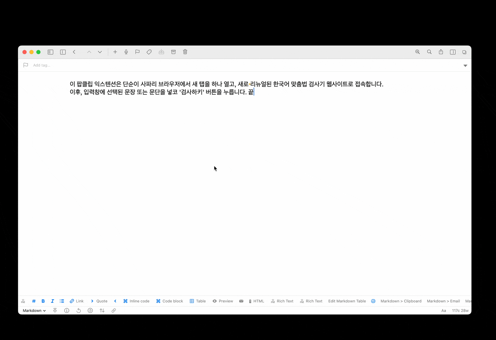

# PopClip Extension - 나라 맞춤법

기존 Popclip Extension : [miname/Korean-Spelling-Checker-Workflow: macOS X Automator의 workflow 형태로 작동하는 한국어 맞춤법 검사기.](https://github.com/miname/Korean-Spelling-Checker-Workflow?tab=readme-ov-file)  

2025년 5월 부산대학교 인공지능연구실과 (주)나라인포테크가 함께 만든 맞춤법 검사기의 새 버전이 나왔다.  
이에 해당 검사기의 API가 변경되었거나 제한을 두고 있는듯 한데, 이 때문인지 이전에 사용하던 PopClip Extension은 더이상 작동하지 않았다.    

이에 간단하게 **선택한 문장 또는 문단을 Safari 브라우저에서 웹사이트를 통해** 실행할 수 있도록 내보내는 PopClip Extension을 새로이 만들었다.  
  

## Extension의 작동 범위 및 조건
- **사파리 브라우저**에서 https://nara-speller.co.kr/ 사이트에 접속
- Popclip 동작으로 가져온 text를 입력 
- '검사하기' 버튼을 클릭

현재 safari 브라우저 외 다른 브라우저는 지원하지 않는다.

## 사용방법

아래 링크에서 다운로드 받을 수 있다.  
[최신버전 다운로드](https://github.com/inchanS/nara-speller/releases/latest)  

다운받은 후, 해당 파일을 더블클릭하면 "등록되지 않은 확장 기능" 이라는 팝업이 나타나지만 가볍게 무시하고 설치해도 된다.  